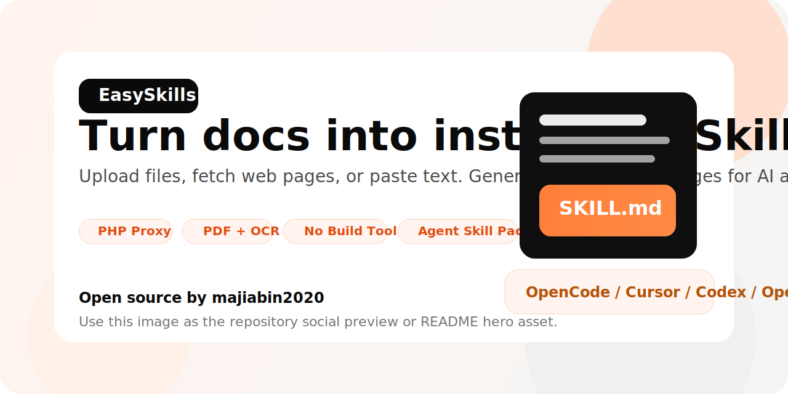
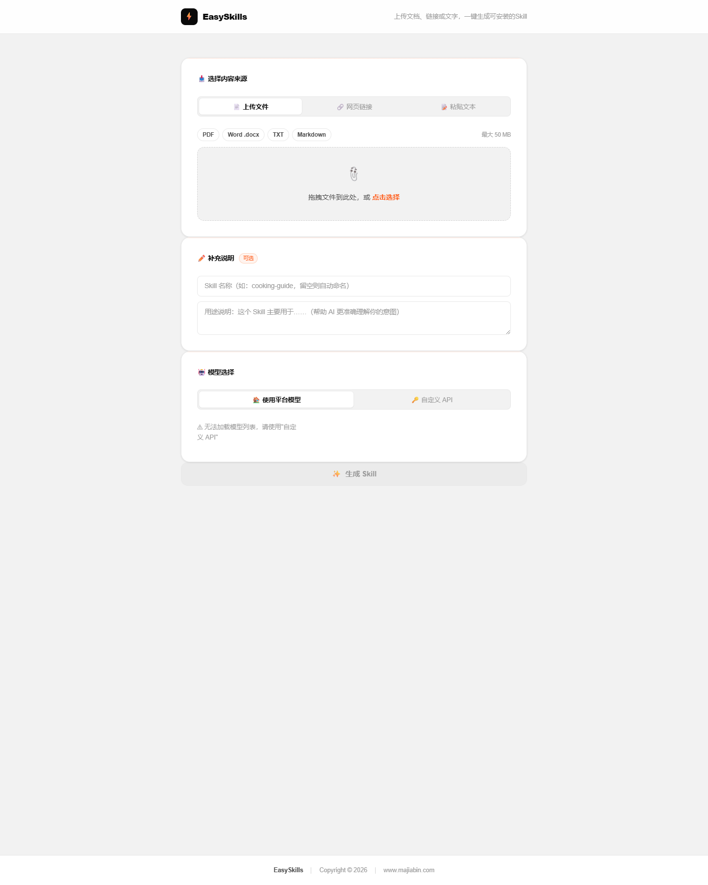

# EasySkills

[English](./README_EN.md)

[](./LICENSE)
[](https://www.php.net/)
[](https://github.com/majiabin2020/skillforge)
[](./CONTRIBUTING.md)



EasySkills 是一个面向 AI Agent 生态的在线 Skill 生成器。用户可以上传文档、抓取网页，或直接粘贴文本内容，系统会自动提取关键信息，调用大模型生成可安装的 `SKILL.md` 结构，并打包为可下载的 `.skill` 或 `.zip` 文件。

这个项目采用纯前端 + PHP 代理的轻量架构，适合部署在常见虚拟主机、宝塔面板或普通 PHP Web 环境中。对于扫描版 PDF，还内置了基于 Tesseract.js 的本地 OCR 流程，尽量减少对外部服务的依赖。

## 产品界面



## 项目特点

- 支持三种输入方式：文件上传、网页链接抓取、直接粘贴文本
- 支持 `PDF`、`DOCX / DOC`、`TXT`、`Markdown` 等常见内容来源
- 普通 PDF 优先走文字层提取，扫描 PDF 自动回退到本地 OCR
- 支持平台内置模型，也支持用户填写自定义 OpenAI 兼容或 Anthropic API
- 生成结果自动打包为标准 Skill 目录结构，包含 `SKILL.md` 和 `references/`
- 内置任务并发控制、排队重试、超时清理与基础 SSRF 防护
- 无需前端构建工具，部署简单，开箱即用

## 适用场景

- 把书籍、教程、手册、课程资料整理成可复用的 Agent Skill
- 把公司内部 SOP、知识库、FAQ 转成结构化执行指令
- 把网页文章、公众号内容、产品文档快速封装为 Agent 可调用能力
- 为 OpenClaw、OpenCode、Codex、Cursor 等工具生成可安装的 Skill 包

## 核心流程

1. 用户通过文件、网页或文本输入原始内容
2. 前端在浏览器内完成内容提取
3. 对长文本进行裁剪，并拼装统一的 Skill 生成 Prompt
4. 通过 `proxy.php` 转发请求到平台模型或用户自定义模型
5. 解析模型返回的 JSON，补齐 `SKILL.md` 和 `references/content.md`
6. 使用 JSZip 在浏览器端打包为 `.skill` / `.zip`
7. 页面展示结果预览，并允许用户下载

## 技术架构

### 前端

- `index.html`：单页应用结构，包含输入区、进度区、结果区
- `app.js`：核心业务逻辑，负责解析文件、OCR、抓取网页、调用模型、打包下载
- `style.css`：完整 UI 样式与响应式布局

### 后端

- `proxy.php`：PHP 代理层，负责模型列表下发、网页抓取、并发控制、LLM 转发
- `setup.php`：依赖安装脚本，用于把前端依赖下载到本地 `lib/`
- `tasks/`：并发任务占位目录，用文件方式记录运行中的请求

### 本地依赖

项目不依赖 npm 或前端打包工具，运行依赖由 `setup.php` 下载到 `lib/` 目录，包括：

- `mammoth`：解析 Word 文档
- `jszip`：浏览器端打包 `.skill` / `.zip`
- `pdfjs-dist`：提取 PDF 文字层
- `tesseract.js`：扫描 PDF OCR
- `chi_sim`、`eng` 语言包：中英文识别

## 目录结构

```text
skillforge/
├─ index.html
├─ app.js
├─ style.css
├─ proxy.php
├─ setup.php
├─ .htaccess
├─ tasks/
│  └─ .htaccess
└─ lib/              # 运行 setup.php 后自动生成
```

## 功能说明

### 1. 内容输入

- 文件上传：支持拖拽上传，限制 50 MB
- 网页抓取：通过 `proxy.php?action=fetch` 抓取 HTML，再在浏览器端抽取正文
- 文本粘贴：适合直接粘贴知识点、文档片段或现成材料

### 2. 文档解析

- Word 文件通过 Mammoth 读取文本内容
- 普通 PDF 优先用 PDF.js 提取文字层
- 当 PDF 文字密度过低时，自动判定为扫描件并切换 OCR
- OCR 默认优先尝试本地 `lib/tessdata/`，失败时回退到在线语言包

### 3. 模型调用

- 平台模式：使用站点管理员在 `proxy.php` 中配置的 API Key
- 自定义模式：用户自行填写 API Key、Base URL、模型名和 API 格式
- 兼容两种接口风格：
  - OpenAI 兼容接口
  - Anthropic 原生接口

### 4. 生成结果

模型需返回固定 JSON 结构，前端会自动整理为：

- `SKILL.md`
- `references/content.md`（原始内容较长时自动补充）
- 压缩包下载结果

### 5. 并发与重试

- `proxy.php` 使用 `tasks/active_*.json` 控制最大并发
- 当服务繁忙时返回 `503`，前端自动等待后重试
- 超时任务会自动清理，避免长时间占位

## 运行环境

- PHP 7.4 及以上
- 已启用 `curl`
- 建议启用 `mbstring`
- Apache 或 Nginx
- 允许 PHP 对 `tasks/` 和 `lib/` 目录写入

## 快速部署

### 1. 上传项目文件

将整个项目上传到网站目录，例如：

```text
/www/wwwroot/your-site/
```

### 2. 配置模型代理

编辑 `proxy.php` 顶部的配置项：

```php
define('PLATFORM_API_KEY',    'YOUR_API_KEY_HERE');
define('PLATFORM_BASE_URL',   'https://api.anthropic.com');
define('PLATFORM_API_FORMAT', 'anthropic'); // 'openai' or 'anthropic'
define('MAX_CONCURRENT',      3);
define('TASK_TIMEOUT_SEC',    600);
```

同时按需调整前端可展示的平台模型：

```php
$PLATFORM_MODELS = [
    [
        'id'          => 'stepfun/step-3.5-flash:free',
        'name'        => 'stepfun/step-3.5-flash',
        'description' => '快速高效，推荐日常使用',
        'format'      => 'openai',
    ],
];
```

### 3. 安装前端依赖

浏览器访问：

```text
https://你的域名/setup.php
```

安装完成后会自动把依赖下载到 `lib/` 目录。

### 4. 设置目录权限

确保以下目录可写：

- `tasks/`
- `lib/`
- `lib/tessdata/`

### 5. 删除或禁用安装脚本

依赖安装完成后，建议删除或重命名 `setup.php`，避免被重复调用。

## Web 服务器说明

### Apache

项目已附带根目录 `.htaccess`，包含基础安全头与压缩配置。`tasks/.htaccess` 会阻止任务占位文件被直接访问。

### Nginx

如果启用了 `gzip_static`，Tesseract 的 `.traineddata.gz` 可能被服务器自动解压，导致 OCR 卡在 0%。可参考以下配置关闭该路径的 gzip：

```nginx
location ~* \.traineddata\.gz$ {
    gzip        off;
    gzip_static off;
    default_type application/octet-stream;
    add_header Access-Control-Allow-Origin *;
    add_header Access-Control-Allow-Private-Network true;
}
```

## 安全说明

项目已经做了几项基础安全处理，但开源部署时仍建议二次审查：

- API Key 保存在服务端 `proxy.php`，不会直接暴露给前端
- 网页抓取增加了基础 SSRF 过滤，阻止私有地址与本地域名
- 打包时会清理 `../` 等路径，避免压缩包目录穿越
- 任务状态文件位于 `tasks/`，并通过 `.htaccess` 禁止直接访问

需要注意：

- 当前示例代码中 `CURLOPT_SSL_VERIFYPEER` 被关闭，正式生产环境建议开启并正确配置证书验证
- CORS 目前为 `*`，如仅供自用或固定域名访问，建议收紧来源
- `setup.php` 不应长期暴露在公网

## 已知限制

- 当前项目为单页面原生实现，没有引入单元测试或自动化构建链路
- 并发控制基于文件锁思路的简化实现，适合轻量站点，不适合高并发集群
- 网页正文抽取采用通用规则，复杂站点可能仍需用户手动粘贴文本
- 模型返回 JSON 格式不稳定时，虽有容错解析，但仍可能生成失败

## 后续可改进方向

- 增加管理员后台与模型配置页面
- 增加生成历史与下载记录
- 支持更多文件格式，如 EPUB、HTML、图片集
- 增加多语言界面与英文 README
- 增加更严格的服务端安全策略与日志系统

## 开源建议

准备推送到 GitHub 前，建议额外确认以下内容：

- `proxy.php` 中未保留真实 API Key
- `lib/` 是否纳入仓库，需要根据发布策略决定
- `setup.php` 是否保留，或仅保留为首次部署工具
- 仓库补充 LICENSE、`.gitignore`、示例截图

## 贡献者

- `majiabin2020`

## License

本项目基于 [MIT License](./LICENSE) 开源发布。
